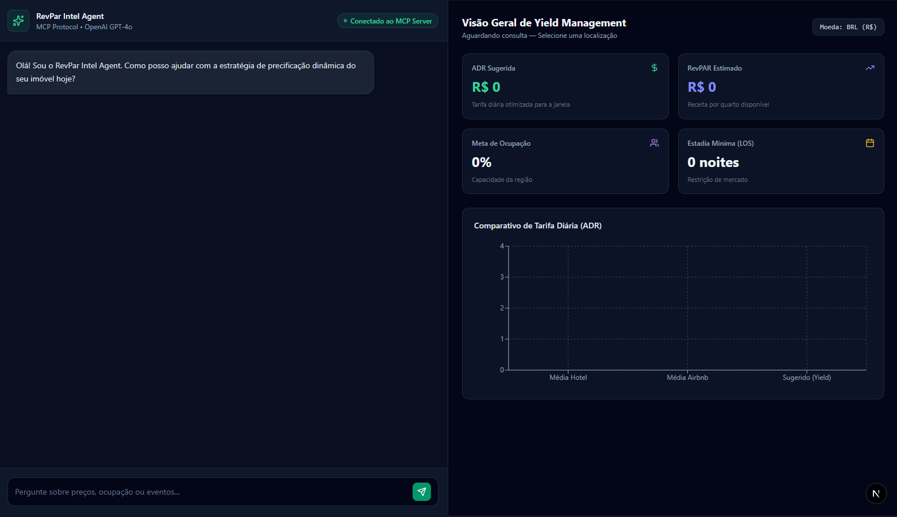
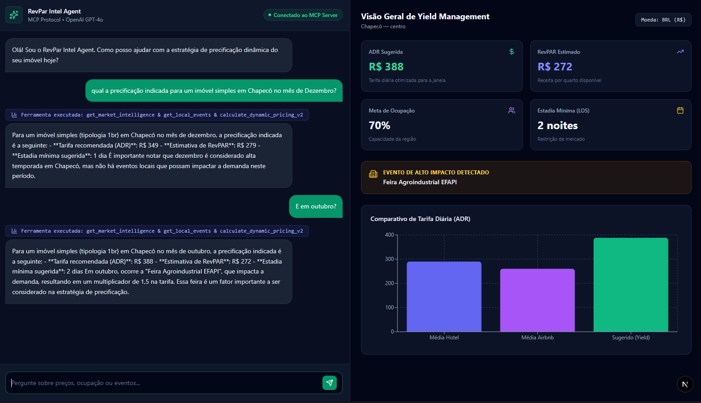

# RevPar MCP

Agente de Revenue Management para hotelaria e aluguel por temporada, com integração entre OpenAI, Model Context Protocol (MCP) e uma interface web em Next.js.

O sistema combina inteligência de mercado, eventos locais e regras determinísticas de precificação para produzir recomendações de ADR, ocupação, RevPAR e estadia mínima (LOS).

> Status: MVP técnico pronto para demonstração e evolução. Os dados de mercado e eventos atualmente são mocks locais; não representam dados de produção.

## Sumário

- [Visão geral](#visão-geral)
- [Principais recursos](#principais-recursos)
- [Arquitetura](#arquitetura)
- [Ferramentas MCP](#ferramentas-mcp)
- [Testes](#testes)
- [Estrutura do projeto](#estrutura-do-projeto)

## Visão geral

O RevPar MCP recebe uma pergunta em linguagem natural, como:

> Qual a diária recomendada para um imóvel de 1 quarto no Centro de Chapecó em fevereiro?

O agente interpreta a solicitação e coordena as ferramentas MCP para:

1. Consultar métricas de mercado por cidade, bairro, mês e tipologia.
2. Identificar eventos locais e seu impacto na demanda.
3. Calcular a tarifa dinâmica, o RevPAR estimado e a estadia mínima recomendada.
4. Retornar uma resposta textual acompanhada de métricas estruturadas para o dashboard.

## Principais recursos

- Dashboard web responsivo para consulta e visualização de indicadores.
- Agente conversacional usando a API Chat Completions da OpenAI.
- Ferramentas MCP com schemas validados por Zod.
- Precificação determinística com:
  - ponderação de ADR Airbnb e hotel;
  - multiplicador de demanda por evento;
  - estratégia de lead time;
  - ajuste por ocupação-alvo;
  - piso operacional de R$ 150 por noite;
  - cálculo de RevPAR;
  - recomendação de LOS.
- Normalização de cidade e bairro, incluindo acentos e variações de caixa.
- Recurso MCP estático com política de precificação.
- Testes automatizados para as ferramentas MCP e o adaptador OpenAI.

## Interface

### Dashboard de Revenue Management

Dashboard desenvolvido para acompanhar ADR sugerida, RevPAR, ocupação, estadia mínima e comparação entre tarifas de mercado.



### Interações com o agente

O agente interpreta perguntas em linguagem natural, consulta as ferramentas MCP e apresenta recomendações de precificação contextualizadas.



## Arquitetura

```text
Usuário
  │
  ▼
Next.js Dashboard (src/app/page.tsx)
  │  POST /api/chat
  ▼
RevParAgent (OpenAI Function Calling)
  │
  ▼
OpenAI Adapter
  │
  ▼
MCP Client ⇄ MCP Server em memória
                    ├── get_market_intelligence
                    ├── get_local_events
                    ├── calculate_dynamic_pricing_v2
                    └── revpar://policies/pricing
```

O servidor MCP é executado em memória pelo adaptador. Isso simplifica o MVP e elimina a necessidade de um processo MCP separado, mas permite substituir posteriormente o transporte por uma implementação persistente ou remota.

## Stack

- Next.js 16
- React 19
- TypeScript 5
- OpenAI SDK
- Model Context Protocol SDK
- Zod
- Tailwind CSS
- Vitest

## Ferramentas MCP

### `get_market_intelligence`

Consulta métricas por localização, tipologia e mês.

Parâmetros principais:

- `city`: cidade.
- `neighborhood`: bairro ou região.
- `propertyType`: `studio`, `1br`, `2br` ou `luxury`.
- `month`: mês numérico de `01` a `12`.

### `get_local_events`

Busca eventos de alto impacto por cidade e mês, incluindo multiplicador de demanda e LOS recomendado.

### `calculate_dynamic_pricing_v2`

Calcula a recomendação de preço com base em:

- `baseAirbnbAdr`;
- `baseHotelAdr`;
- `targetOccupancy`;
- `eventDemandMultiplier`;
- `eventMinStayDays`;
- `leadTimeDays`.

O retorno inclui `suggestedAdr`, `estimatedRevPar` e `suggestedMinStayDays`.

## Testes

Os testes foram pensados para validar as partes mais importantes do domínio, sem depender de uma chamada real à API da OpenAI.

- `tests/tools.test.ts` verifica as regras de negócio do motor de Revenue Management: diferenciação por tipologia e localização, identificação de eventos, impacto da demanda, estratégia de lead time, RevPAR e estadia mínima.
- `tests/adapter.test.ts` verifica o contrato de integração entre o servidor MCP e o formato de ferramentas esperado pela OpenAI.

Essa separação torna os testes rápidos e previsíveis: a camada determinística de cálculo pode evoluir com segurança, enquanto a integração com o modelo permanece isolada.

A suíte é executada com Vitest:

```bash
npm test
```

## Estrutura do projeto

```text
src/
├── agent/
│   ├── openaiAdapter.ts   # Ponte MCP → ferramentas OpenAI
│   └── runner.ts          # Orquestração conversacional e métricas
├── app/
│   ├── api/chat/route.ts   # Endpoint HTTP do agente
│   ├── globals.css         # Estilos globais
│   ├── layout.tsx          # Layout raiz
│   └── page.tsx            # Dashboard
├── mcp/
│   ├── mockData.ts         # Dados locais de mercado e eventos
│   ├── server.ts           # Servidor MCP e resource de política
│   └── tools.ts            # Tools MCP e regras de pricing
tests/
├── adapter.test.ts         # Contrato MCP/OpenAI
└── tools.test.ts           # Regras das ferramentas de negócio
```
